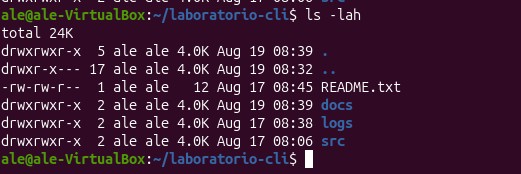

# Permisos de archivos y directorios

| Nombre | Tipo | Permisos | Propietario | Grupo | Tamaño | Fecha | Octal |
|--------|------|----------|-------------|-------|--------|-------|-------|
| .          | Directorio | drwxrwxr-x | ale | ale | 4.0K | Aug 19 08:39 | 775 |
| ..         | Directorio | drwxr-x--- | ale | ale | 4.0K | Aug 19 08:32 | 750 |
| README.txt | Archivo    | -rw-rw-r-- | ale | ale | 12   | Aug 17 08:45 | 664 |
| docs       | Directorio | drwxrwxr-x | ale | ale | 4.0K | Aug 17 08:39 | 775 |
| logs       | Directorio | drwxrwxr-x | ale | ale | 4.0K | Aug 17 08:38 | 775 |
| src        | Directorio | drwxrwxr-x | ale | ale | 4.0K | Aug 17 08:06 | 775 |

## Notas

- El primer carácter (`-` o `d`) indica el tipo: `-` para archivo regular, `d` para directorio.
- Cada terna de caracteres (`rwx`) representa permisos de lectura (r), escritura (w) y ejecución (x).
- El valor octal se obtiene sumando: r=4, w=2, x=1, para cada uno de los tres grupos (propietario, grupo, otros).
- Los datos provienen directamente de la salida real de `ls -lah`.
